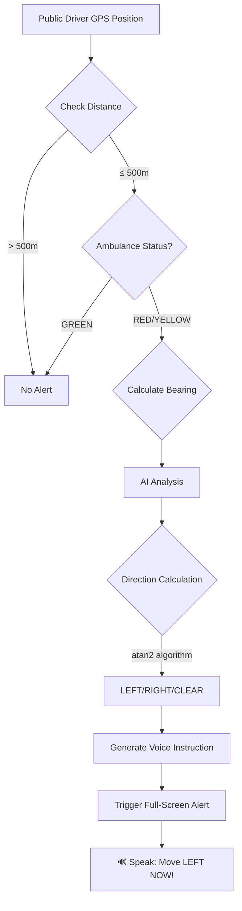

<div align="center">

# 🚑 AMBUCLEAR
### *AI-Powered Emergency Vehicle Smart Alert System*

[](#deployment-url)
[](#github-url)

**Clearing the Path, Saving Lives - Every Second Counts**

*An intelligent Next.js-based system that uses AI to automatically alert nearby drivers when emergency vehicles approach, providing real-time directional guidance (LEFT/RIGHT) through voice and visual notifications.*

---

### 🎯 **[Try It Live](#deployment-url)** | 📚 **[Documentation](#-documentation)**

---

</div>

## ✨ Key Highlights

<table>
<tr>
<td align="center">🤖<br/><b>AI Powered</b><br/>Ultra-fast intelligent<br/>route optimization</td>
<td align="center">🎤<br/><b>Voice Guidance</b><br/>LEFT/RIGHT instructions<br/>in real-time</td>
<td align="center">🔥<br/><b>Firebase Realtime</b><br/>Live ambulance<br/>tracking</td>
<td align="center">⚡<br/><b>Fast Alerts</b><br/>Real-time emergency<br/>notifications</td>
</tr>
<tr>
<td align="center">🗺️<br/><b>Google Maps</b><br/>Precision GPS<br/>navigation</td>
<td align="center">📡<br/><b>WebSocket Live</b><br/>Pusher real-time<br/>updates</td>
<td align="center">🎯<br/><b>High Accuracy</b><br/>Intelligent<br/>direction detection</td>
<td align="center">🌐<br/><b>Production Ready</b><br/>Deployed on<br/>Vercel</td>
</tr>
</table>

---

## 🎯 Features

### 🚑 For Ambulance Drivers

<details>
<summary><b>Click to expand features</b></summary>

- ✅ **Profile Registration**: Register with name, phone, vehicle number, and hospital
- 🔴🟡🟢 **Three Status Modes**:
  - **🔴 Red Alert**: Emergency patient mode - broadcasts alerts, enables AI navigation
  - **🟡 Yellow**: Non-emergency mode - navigation only, no alerts sent
  - **🟢 Green**: Available mode - monitor other active ambulances
- 🆘 **SOS Button**: Emergency alert broadcast to all available ambulances and control room
- 📍 **GPS Auto-tracking**: Real-time location updates every 2 seconds with Firebase sync
- 🏥 **Hospital Navigation**: AI-powered route to nearest hospitals with live ETA
- 🎤 **Turn-by-turn Voice**: AI generates contextual navigation instructions
- 📊 **Live Dashboard**: Real-time tracking and status management

</details>

### 🚗 For Public Drivers

<details>
<summary><b>Click to expand features</b></summary>

- 🔓 **No Login Required**: Anonymous alert monitoring for privacy
- 📍 **GPS Permission-Based**: Automatic alert detection within 500m radius
- 🔊 **Full-Screen Alerts**: Visual + audio + vibration + voice notifications
- 🧠 **Smart Detection**: 
  - AI analyzes your position vs ambulance trajectory
  - Calculates if you're in the path (LEFT/RIGHT/CLEAR_AHEAD)
  - Only alerts if ambulance is approaching **on same route direction**
- 🎙️ **Text-to-Speech**: Clear voice instructions: *"Move LEFT NOW!"* or *"Move RIGHT immediately!"*
- ⏸️ **Temporary Disable**: Option to pause alerts for 15-60 minutes
- 🚦 **Route Intelligence**: Uses bearing calculation for precision

</details>

### 🎛️ For Control Room

<details>
<summary><b>Click to expand features</b></summary>

- 🔒 **Password Protected**: Admin access for secure monitoring
- 📊 **Real-time Monitoring**: Live tracking of all active RED/YELLOW ambulances on map
- 🤖 **AI Recommendations**: AI analyzes traffic patterns every 10 seconds
  - Suggests optimal route clearance strategies
  - Estimates time savings
  - Predicts traffic congestion based on ambulance speed
- 🆘 **SOS Management**: View and resolve emergency SOS alerts with one click
- 📈 **Dashboard Stats**: Real-time overview of active emergencies and response times
- 🗺️ **Google Maps Integration**: Visual ambulance tracking with status indicators
- 🔊 **Voice Announcements**: AI recommendations read aloud automatically

</details>

## 🏗️ Tech Stack

<div align="center">

### **Frontend & Framework**
[](https://nextjs.org/)
[](https://www.typescriptlang.org/)
[](https://react.dev/)
[](https://tailwindcss.com/)

### **Backend & Database**
[](https://firebase.google.com/)
[](https://vercel.com/)

### **Real-time & APIs**
[](https://pusher.com/)
[](https://developers.google.com/maps)

</div>

| Component | Technology | Purpose |
|-----------|------------|---------|
| **Frontend** | Next.js 14 (App Router) + TypeScript | Server-side rendering, type safety |
| **Styling** | Tailwind CSS | Responsive, utility-first design |
| **Backend** | Next.js API Routes (Serverless) | Scalable REST APIs |
| **Database** | Firebase Firestore | Real-time NoSQL database |
| **Real-time** | Pusher WebSockets | Live ambulance position broadcasting |
| **Maps** | Google Maps API | GPS navigation, routes, traffic, ETA |
| **Voice** | Web Speech API | Browser text-to-speech synthesis |
| **Deployment** | Vercel | Global CDN, auto-scaling |

## 📂 Project Structure

```
AMBUCLEAR/
├── app/
│   ├── page.tsx (Homepage)
│   ├── layout.tsx (Root layout)
│   ├── globals.css
│   ├── ambulance/
│   │   ├── page.tsx (Ambulance dashboard)
│   │   └── dashboard/page.tsx (Driver dashboard)
│   ├── public/page.tsx (Public driver interface)
│   ├── control/page.tsx (Control room)
│   └── api/ (All API routes)
├── components/ (Reusable React components)
├── data/ (JSON data & configuration)
├── lib/ (Utilities & services)
├── public/ (Static assets)
├── package.json
├── tsconfig.json
├── tailwind.config.ts
├── next.config.js
├── vercel.json
└── README.md
```

## 🧮 AI Alert Engine Logic

<div align="center">


```mermaid
graph TD
    A[Public Driver GPS Position] --> B{Check Distance}
    B -->|> 500m| C[No Alert]
    B -->|≤ 500m| D{Ambulance Status?}
    D -->|GREEN| C
    D -->|RED/YELLOW| E{Calculate Bearing}
    E --> F[AI Analysis]
    F --> G{Direction Calculation}
    G -->|atan2 algorithm| H[LEFT/RIGHT/CLEAR]
    H --> I[Generate Voice Instruction]
    I --> J[Trigger Full-Screen Alert]
    J --> K[🔊 Speak: Move LEFT NOW!]
```

</div>

### **Alert Thresholds**

- 🔴 **Distance Radius**: 500 meters
- 📐 **Heading Difference**: ±30 degrees
- ⏱️ **Update Frequency**: Every 2 seconds (ambulance), 500ms (public driver alerts)
- 🎯 **Accuracy**: High-precision direction calculation

## 🚀 Installation & Setup

### Prerequisites

```bash
✅ Node.js 18+ installed
✅ Google Maps API key (with Maps JavaScript API, Directions API, Places API enabled)
✅ Firebase project (Firestore database)
✅ (Optional) Pusher account for WebSocket real-time
```

### Step 1: Clone Repository

```bash
git clone https://github.com/[USERNAME]/AMBUCLEAR.git
cd AMBUCLEAR
```

### Step 2: Install Dependencies

```bash
npm install
```

### Step 3: Configure Environment Variables

Create a `.env.local` file in the root directory:

```env
# 🗺️ Google Maps API Key (REQUIRED)
NEXT_PUBLIC_GOOGLE_MAPS_API_KEY=your_google_maps_api_key_here

# 🔥 Firebase Configuration (REQUIRED)
NEXT_PUBLIC_FIREBASE_API_KEY=your_firebase_api_key
NEXT_PUBLIC_FIREBASE_AUTH_DOMAIN=your-project.firebaseapp.com
NEXT_PUBLIC_FIREBASE_PROJECT_ID=your-project-id
NEXT_PUBLIC_FIREBASE_STORAGE_BUCKET=your-project.firebasestorage.app
NEXT_PUBLIC_FIREBASE_MESSAGING_SENDER_ID=your_sender_id
NEXT_PUBLIC_FIREBASE_APP_ID=your_app_id

# 📡 Pusher WebSocket (OPTIONAL - for real-time updates)
NEXT_PUBLIC_PUSHER_KEY=your_pusher_key
NEXT_PUBLIC_PUSHER_CLUSTER=ap2
PUSHER_APP_ID=your_app_id
PUSHER_SECRET=your_pusher_secret

# 🔒 Control Room Password
CONTROL_ROOM_PASSWORD=admin123

# ⚙️ Alert Settings (OPTIONAL)
ALERT_RADIUS_METERS=500
HEADING_DIFFERENCE_THRESHOLD=30
GPS_UPDATE_INTERVAL=2000
```

### Step 4: Run Development Server

```bash
npm run dev
```

Open [http://localhost:3000](http://localhost:3000) in your browser.

### Step 5: Build for Production

```bash
npm run build
npm start
```

---

## 🌐 Deployment to Vercel ⚡

Vercel is optimized for Next.js apps with perfect API route performance.

### ✅ Pre-Deployment Checklist

- ✓ Build successful (`npm run build`)
- ✓ No TypeScript errors
- ✓ All dependencies installed
- ✓ Environment variables configured locally
- ✓ Git repository initialized

### Option 1: ⭐ Deploy via GitHub (Recommended & Easiest)

**Step 1: Push to GitHub**
```bash
git add .
git commit -m "🚀 Ready for production deployment"
git push origin main
```

**Step 2: Import to Vercel**
1. Go to [vercel.com](https://vercel.com)
2. Sign in with GitHub
3. Click **"Add New"** → **"Project"**
4. Select your **AMBUCLEAR** repository
5. Framework: **Next.js** (auto-detected)
6. Root Directory: **`.`** (default)

**Step 3: Set Environment Variables**
In Vercel dashboard → **Settings** → **Environment Variables**, add all variables from `.env.local`

✅ Click **"Deploy"** and Vercel handles the rest!

---

### Option 2: Deploy via Vercel CLI

```bash
npm install -g vercel
vercel login
vercel --prod
```

---

## 📱 Usage Guide

### 🚑 For Ambulance Drivers

<details>
<summary><b>Step-by-Step Workflow</b></summary>

**First-Time Setup:**
```bash
1. Navigate to [DEPLOYMENT_URL]/ambulance
2. Click "Register New Ambulance"
3. Fill in driver details
4. Submit → Receive unique Ambulance ID
```

**Daily Usage:**
```bash
1. Login with your Ambulance ID
2. Set Status:
   🔴 RED: Emergency → Alerts public drivers
   🟡 YELLOW: Non-emergency → Navigation only
   🟢 GREEN: Available → Monitor other ambulances
3. GPS auto-updates every 2 seconds
4. Get AI-powered route recommendations
```

</details>

### 🚗 For Public Drivers

<details>
<summary><b>How It Works (Zero Setup Required)</b></summary>

**One-Time Permission:**
```bash
1. Visit [DEPLOYMENT_URL]/public
2. Allow location access
3. Keep page active
```

**When Ambulance Approaches:**
- Full-screen alert with direction (LEFT/RIGHT)
- Voice instruction: "Move LEFT NOW!"
- Automatic vibration & sound notification
- Countdown: "250 meters... 200 meters..."

</details>

### 🎛️ For Control Room Operators

<details>
<summary><b>Monitoring & Management</b></summary>

**Access Control Room:**
```bash
1. Navigate to [DEPLOYMENT_URL]/control
2. Enter password: admin123
3. Monitor live ambulances on map
4. View AI recommendations
5. Manage SOS alerts
```

</details>

## 🔒 Security Considerations

- Control room uses password authentication
- No sensitive user data stored
- GPS data not permanently stored
- Environment variables encrypted by Vercel
- HTTPS enabled by default on Vercel

## 🐛 Troubleshooting

### GPS Not Working
- Ensure HTTPS (required for geolocation)
- Check browser location permissions
- Verify device has location services enabled

### Alerts Not Triggering
- Verify ambulance status is 🔴 RED
- Check distance is ≤ 500 meters
- Both parties must allow GPS
- Check Firebase security rules

### Firebase Errors
- Verify all NEXT_PUBLIC_FIREBASE_* variables
- Check Firebase security rules are correct
- Re-deploy if using Vercel

### Pusher WebSocket Issues
- System works without Pusher (uses polling)
- Optional service - safe to ignore errors

### Voice Not Speaking
- Check browser support (Chrome, Firefox, Safari)
- Verify device volume is on
- Check browser is not muted

---

## 🚀 Deployment Checklist

| Status | Item |
|--------|------|
| ⏳ | *Deployment URL to be added: [DEPLOYMENT_URL]* |
| ⏳ | *GitHub Repository URL to be added: [GITHUB_URL]* |
| ⏳ | *GitHub Username to be added: [USERNAME]* |

Once deployed and ready to share, these URLs can be added to make links active.

---

<div align="center">

### 🚑 **Every Second Counts. Every Life Matters.** 🚑

**Built with ❤️ for emergency response**

*Give way to ambulances, save lives together* 🙏

---

*Made with Next.js 14 • Powered by Firebase • Deployed on Vercel*

</div>

---

## 📄 License

MIT License - Feel free to use for emergency response systems

---

## 🤝 Contributing

We welcome contributions! Here's how:

1. **Fork** the repository
2. **Create** a feature branch
3. **Commit** your changes
4. **Push** to the branch
5. **Open** a Pull Request

---

## 📞 Support & Contact

- 🐛 **Bug Reports**: Open an issue on GitHub
- 💡 **Feature Requests**: Suggest ideas on GitHub
- 💬 **Discussions**: GitHub Discussions section

---

## 📋 Final Steps for Deployment

When you're ready to deploy:

1. **Provide your GitHub username** - For repository URL
2. **Provide your Vercel deployment URL** - Once deployed
3. **I'll update all links** - In this README
4. **I'll push everything to GitHub** - All changes committed and pushed

Just share these three pieces of information and I'll take care of the rest! 🚀
